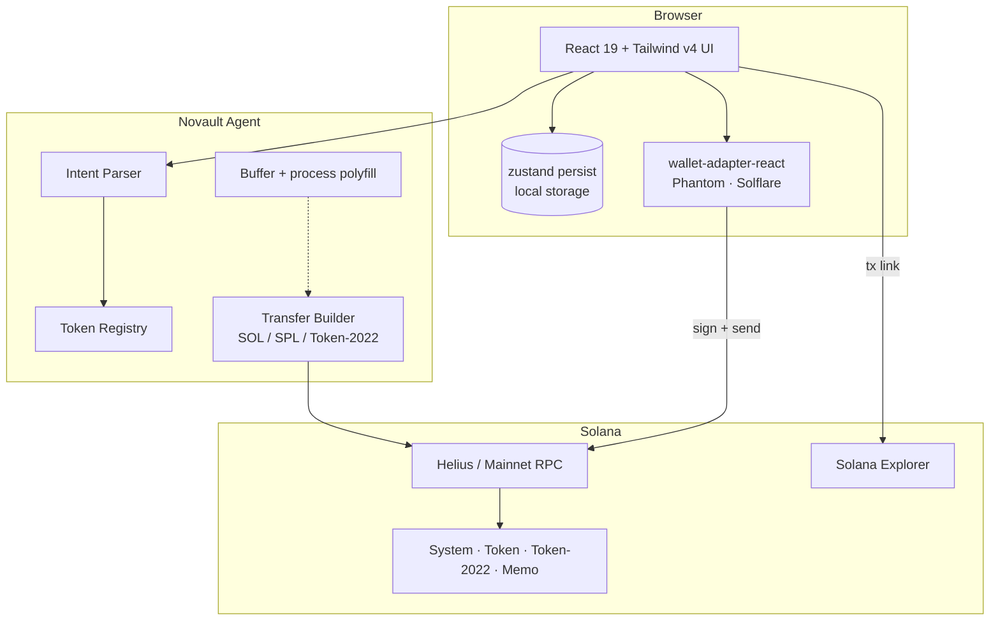

<div align="center">


# Novault Agent

**Non‑custodial private transfer console for Solana mainnet.**
Compose transfers in natural language, review every step, sign with your wallet — funds never leave your custody.

[](https://solana.com)
[](https://react.dev)
[](https://vitejs.dev)
[](https://www.typescriptlang.org)
[](https://tailwindcss.com)
[](https://pnpm.io)
[](https://helius.dev)
[](#license)

</div>

---

## ✨ Highlights

- 🔒 **Non‑custodial.** No private keys ever touch the app. Every transfer is signed by Phantom / Solflare / any wallet‑standard wallet.
- 🪙 **Real SOL & SPL transfers.** Native SOL via `SystemProgram.transfer`, SPL & **Token‑2022** via `createTransferCheckedInstruction`, with auto‑created recipient ATAs and on‑chain decimals.
- 🧠 **Natural‑language intent parser.** “Send 25 USDC to 9xQ…xyz every Friday” is parsed into a structured draft you can edit before signing.
- 🛡️ **Mainnet‑only, fail‑loud.** No devnet, no mocked data, no silent fallbacks. Confidential Transfer (ZK) browser‑proof generation honestly returns `UnsupportedFeature`.
- 🎨 **Cyber‑finance UI.** Dark glass panels, mint accent, mono typography. Built with Tailwind v4, Radix UI, and Framer Motion.
- ⚡ **Drop‑in Helius RPC.** Set `VITE_SOLANA_RPC_URL` and your custom RPC is used everywhere.

---

## 📦 Project Map

```text
.
├── artifacts/
│   ├── novault-agent/              # 🎯 Main React+Vite web app  (this README)
│   │   ├── src/
│   │   │   ├── pages/              # Dashboard, Transfer, Review, Tokens, Activity…
│   │   │   ├── components/         # AppShell + shadcn/ui primitives
│   │   │   ├── lib/
│   │   │   │   ├── solana/         # connection, transfers, tokenAccounts, registry…
│   │   │   │   ├── agent/          # intentParser
│   │   │   │   └── storage/        # local activity & recipients
│   │   │   ├── store/              # zustand persist store
│   │   │   └── types/              # shared TS types
│   │   └── public/logofav.png
│   ├── api-server/                 # Express stub (currently unused by the web app)
│   └── mockup-sandbox/             # Vite preview server for canvas mockups
└── pnpm-workspace.yaml
```

---

## 🧭 How It Works

```mermaid
flowchart LR
    U[👤 User] -->|types intent| T[📝 Transfer Page]
    T -->|parseTransferIntent| P[🧠 Intent Parser]
    P -->|symbol → mint| R[(📚 Token Registry)]
    P --> D[📄 Draft Object]
    D --> RV[🔍 Review Page]
    RV -->|buildTransferFromDraft| B{Asset Type?}
    B -->|SOL| SOL[SystemProgram.transfer]
    B -->|SPL / Token‑2022| SPL[createTransferCheckedInstruction\n+ ensure recipient ATA]
    SOL & SPL --> TX[📦 Transaction + recent blockhash]
    TX -->|wallet.sendTransaction| W[👛 Phantom / Solflare]
    W -->|signed| RPC[🌐 Helius RPC / Mainnet]
    RPC -->|signature| C[⏳ confirmTransaction\nblockhash strategy]
    C -->|confirmed| AC[📜 Activity Log]
    AC -->|Explorer link| EX[🔗 explorer.solana.com]
```



### Step‑by‑step

1. **Compose** — On `/transfer`, type a natural sentence: *“Send 0.5 SOL to 9xQ…xyz”* or *“Transfer 25 USDC to …”*.
2. **Parse** — `intentParser.ts` extracts action, amount, token symbol, recipient, schedule, privacy mode, memo.
3. **Resolve** — `tokenRegistry.ts` maps the symbol (SOL, USDC, USDT, BONK, JUP, WSOL) to a real mainnet mint. Unknown symbols become explicit errors — never silently fall back to SOL.
4. **Edit** — You can tweak any field inline before continuing.
5. **Review** — On `/review`, **Check Readiness** queries the wallet’s token accounts via RPC and confirms whether the recipient is reachable, whether the mint is Token‑2022, etc.
6. **Build** — `buildTransferFromDraft` constructs the real instruction set, fetches mint decimals on‑chain, converts amounts via **BigInt** (no float rounding), and adds an `AssociatedTokenAccount` create instruction if the recipient ATA is missing.
7. **Sign** — Wallet popup opens, you approve. The exact same blockhash captured at build time is used for confirmation.
8. **Confirm** — `confirmTransaction({ signature, blockhash, lastValidBlockHeight })` polls until finality. The signature, status, and description are saved to the local activity log with a Solana Explorer link.

---

## 🔐 Privacy Model

| Mode | What it hides | Status |
|------|----------------|--------|
| **Standard** SOL / SPL / Token‑2022 | Nothing extra — public addresses and amounts | ✅ Fully implemented |
| **Confidential Transfer** (Token‑2022) | Hides amount via ElGamal encryption + ZK proof | ⚠️ Returns `UnsupportedFeature` — browser ZK proof generation isn’t available in `@solana/spl-token` yet. The app is **honest** about this rather than faking success. |

> Confidential Transfers will be enabled when a usable browser proving stack lands. Until then, use a CLI / backend that can produce the ElGamal proofs.

---

## 🚀 Getting Started

### Prerequisites

- Node.js **24+**
- pnpm **10+**
- A Solana wallet browser extension (Phantom or Solflare)
- *(Optional but recommended)* a Helius RPC URL

### Install & run

```bash
pnpm install
pnpm --filter @workspace/novault-agent run dev
```

Open the URL Vite prints. The dev server is also served via the Replit preview at the root path (`/`).

### Production build

```bash
pnpm --filter @workspace/novault-agent run build
pnpm --filter @workspace/novault-agent run serve
```

### Typecheck the whole repo

```bash
pnpm run typecheck
```

---

## ⚙️ Configuration

All sensitive values live in environment variables. **Never commit RPC URLs that contain API keys.**

| Variable | Required | Description |
|----------|:--------:|-------------|
| `VITE_SOLANA_RPC_URL` | Recommended | Your custom mainnet RPC (e.g. Helius). Falls back to `https://api.mainnet-beta.solana.com` (rate‑limited). |
| `PORT` | ✅ (auto by Replit) | Port the Vite dev server binds to. |
| `BASE_PATH` | ✅ (auto by Replit) | Base URL prefix injected into `import.meta.env.BASE_URL`. |

On Replit, add `VITE_SOLANA_RPC_URL` via **Tools → Secrets**, then restart the `artifacts/novault-agent: web` workflow.

---

## 🧱 Architecture



### Stack

| Layer | Tech |
|-------|------|
| UI | React 19, Vite 7, Tailwind v4, Radix UI, Framer Motion, Lucide |
| Routing | wouter |
| State | zustand (persisted) + TanStack Query |
| Solana | `@solana/web3.js`, `@solana/spl-token` (incl. Token‑2022), `@solana/wallet-adapter-*` |
| Build | pnpm workspaces, TypeScript 5.9, esbuild |

---

## 🗺️ Pages

| Route | Purpose |
|-------|---------|
| `/` | **Dashboard** — wallet snapshot, SOL balance, network status |
| `/transfer` | **New Transfer** — natural‑language composer + parsed‑intent editor |
| `/review` | **Review** — readiness check, build, sign, confirm |
| `/tokens` | **Tokens** — list of SPL & Token‑2022 holdings via `getParsedTokenAccountsByOwner` |
| `/activity` | **Activity** — locally‑logged submissions with Explorer links |
| `/recipients` | **Recipients** — saved address book (local only) |
| `/settings` | **Settings** — RPC info, default privacy mode, network badge |

---

## 🧪 Supported Assets (out of the box)

| Symbol | Mint | Program |
|--------|------|---------|
| `SOL` | *native* | System Program |
| `USDC` | `EPjFWdd5AufqSSqeM2qN1xzybapC8G4wEGGkZwyTDt1v` | SPL Token |
| `USDT` | `Es9vMFrzaCERmJfrF4H2FYD4KCoNkY11McCe8BenwNYB` | SPL Token |
| `BONK` | `DezXAZ8z7PnrnRJjz3wXBoRgixCa6xjnB7YaB1pPB263` | SPL Token |
| `JUP`  | `JUPyiwrYJFskUPiHa7hkeR8VUtAeFoSYbKedZNsDvCN` | SPL Token |
| `WSOL` | `So11111111111111111111111111111111111111112` | SPL Token |

> Want another token? Add it to `src/lib/solana/tokenRegistry.ts` — the program (SPL vs Token‑2022) and decimals are auto‑detected on‑chain when the transfer is built.

---

## 🛡️ Safety Notes

- ✅ Amounts are converted with **BigInt string math** — `0.0000001 USDC` will refuse to send instead of rounding to zero.
- ✅ Every transaction is **confirmed against the same blockhash** that was used to sign it (no false‑positives from blockhash drift).
- ✅ The recipient ATA is created in the same transaction if missing — one signature, atomic.
- ✅ Unknown token symbols are a **hard error**, never a silent fallback to SOL.
- ✅ Confidential mode never lies — it returns a typed `UnsupportedFeature` with a reason and suggestion.
- 🚫 The app **never** asks for a seed phrase. If anything ever does — close the tab.

---

## 🧰 Common commands

```bash
# Run the web app
pnpm --filter @workspace/novault-agent run dev

# Typecheck only this artifact
pnpm --filter @workspace/novault-agent run typecheck

# Typecheck the entire workspace
pnpm run typecheck

# Production build
pnpm --filter @workspace/novault-agent run build
```

---

## 🔗 Useful Links

- 🌐 **Solana Docs** — <https://solana.com/docs>
- 🪙 **SPL Token‑2022** — <https://spl.solana.com/token-2022>
- 🔭 **Solana Explorer** — <https://explorer.solana.com>
- 👛 **Phantom Wallet** — <https://phantom.app>
- 👛 **Solflare Wallet** — <https://solflare.com>
- ⚡ **Helius RPC** — <https://helius.dev>
- 🧱 **wallet‑adapter** — <https://github.com/anza-xyz/wallet-adapter>

---

## 🤝 Contributing

1. Fork & clone.
2. `pnpm install`.
3. Add your feature, ensure `pnpm run typecheck` passes.
4. Open a PR with a short rationale and (if you touched transfer logic) a transaction signature on mainnet to prove it works end‑to‑end.

---

## 📜 License

MIT © Novault Agent contributors.
